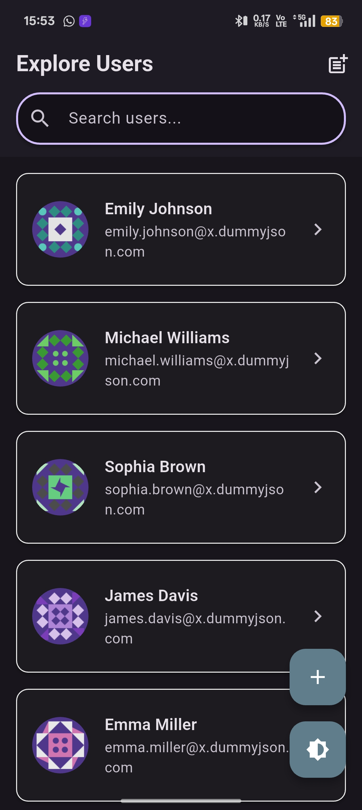
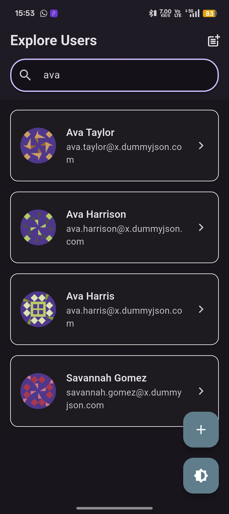
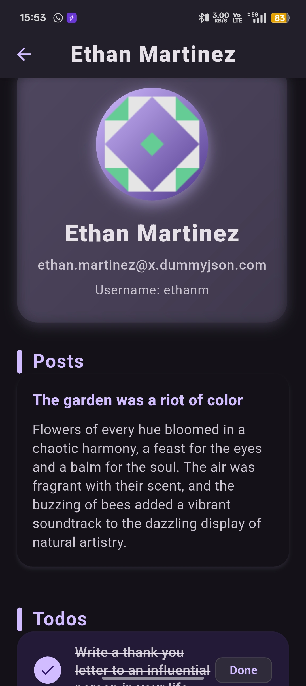
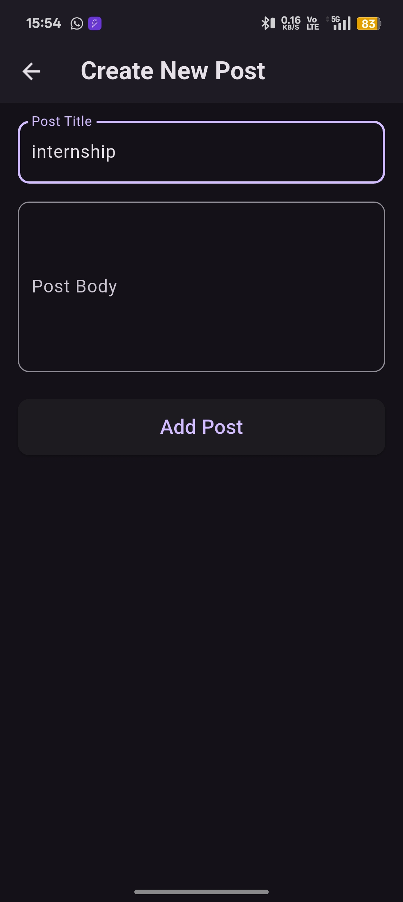
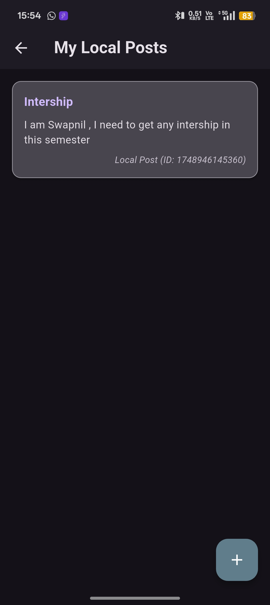

# 👤 User Management Flutter App

A robust and scalable **Flutter application** built with **Clean Architecture** and the **BLoC pattern**, showcasing advanced skills in state management, API integration, pagination, and modular development.

> 🚀 Designed as a professional-level Flutter app using Clean Architecture and the BLoC pattern.

---

## 📱 Project Overview

This app demonstrates a fully-featured **User Management System** consuming the [DummyJSON Users API](https://dummyjson.com/users). It includes:
- Infinite scrolling for user listing
- Real-time search
- User detail view with posts & todos
- Local post creation
- Clean code practices with separation of concerns

---

## ✨ Features

### 🧑‍💼 User List
- Paginated fetching from DummyJSON API
- Infinite scrolling with auto-load
- Real-time search with debounce
- (Bonus) Pull-to-refresh

### 🔎 Search
- Search bar with instant filtering
- Debounced API calls for optimized performance

### 👤 User Details
- Detailed view on tap: avatar, name, email, etc.
- Nested API calls:
  - `/posts/user/{userId}`
  - `/todos/user/{userId}`
- Efficient state management via BLoC

### 📝 Create Post
- Locally create posts (title + body)
- Instant appearance in user's detail view (no API update)

### 🌓 UI/UX
- Modern and responsive design
- Loading indicators and skeleton loaders
- Robust error handling
- (Bonus) Light/Dark mode toggle

### 📦 Bonus (Optional)
- Pull-to-refresh for the user list
- Offline caching (e.g., with `shared_preferences` or `hive`)

---

## 🖼️ Screenshots

| 📋 User List | 🔍 Search User |
|-------------|----------------|
|  |  |

| 👤 User Details | ➕ Create Post |
|----------------|----------------|
|  |  |

| 👤 Local post list | 
|----------------|
|  | 


---

## 🎞️ Demo (Optional)

You can record a short demo of your app using tools like OBS Studio or a screen recording app and include a GIF preview here:

```markdown

```

# 🏗️ Architecture
Built on Clean Architecture principles for modularity, testability, and scalability:
```markdown
lib/
├── blocs/           # BLoC and Cubits for managing state
├── models/          # User, Post, Todo data classes with JSON parsing
├── repositories/    # API integration and data handling
├── screens/         # UI pages (List, Detail, Create)
├── widgets/         # Reusable UI components
└── main.dart        # App entry point

```

## 🧱 Layers Explained

### 🖼️ Presentation Layer
- Screens, widgets, layout
- Interacts only with BLoC/Cubit

### 🔁 BLoC Layer
- Handles state & event management via `flutter_bloc`
- Manages:
  - User list (fetch, search, paginate)
  - User details (posts & todos)
  - Post creation
- Emits precise states (`loading`, `success`, `error`)

### 🔗 Repository Layer
- Handles all API communication
- Transforms and parses responses
- Acts as a bridge between BLoC and APIs

### 🧩 Models
- Dart data models with `fromJson()` and `toJson()` methods
- Easily extendable for future requirements

---

## 🔄 State Management Flow

### 📥 Example: `UserListBloc`
```text
Event:        FetchUsers
     ↓
State:        UserListLoading
     ↓
Repository:   Fetch users from API
     ↓
State:        UserListLoaded / UserListError
```
## Other flows include:

- UserDetailBloc: Handles post & todo fetching

- PostCreationCubit: Manages new local post creation

# 🧪 Setup & Run
# 📥 Clone the Repository
```markdown
git clone https://github.com/SWAPNILSHAW/user_management.git
cd user_management
```
# 📦 Install Dependencies
```markedown
flutter pub get
```
# ▶️ Run the App
```markedown

flutter run
```
# ✅ Submission Checklist
- Public GitHub repository: SWAPNILSHAW/user_management

- Clean Architecture & BLoC Pattern

- Real-time Search & Infinite Scroll

- API Integration (User, Post, Todo)

- Responsive, Modern UI/UX

- Bonus: Light/Dark Mode

- README with architecture and setup guide

# 📚 Resources

- [DummyJSON API](https://dummyjson.com/)
  
- [flutter_bloc](https://pub.dev/packages/flutter_bloc)
  
- [Flutter Official Docs](https://docs.flutter.dev/)

# 👨‍💻 Author
## Swapnil Shaw
GitHub: @SWAPNILSHAW
📧 Available for internship and full-time opportunities
